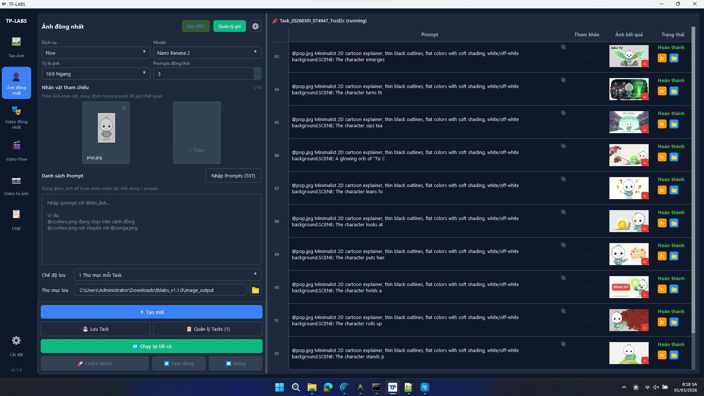
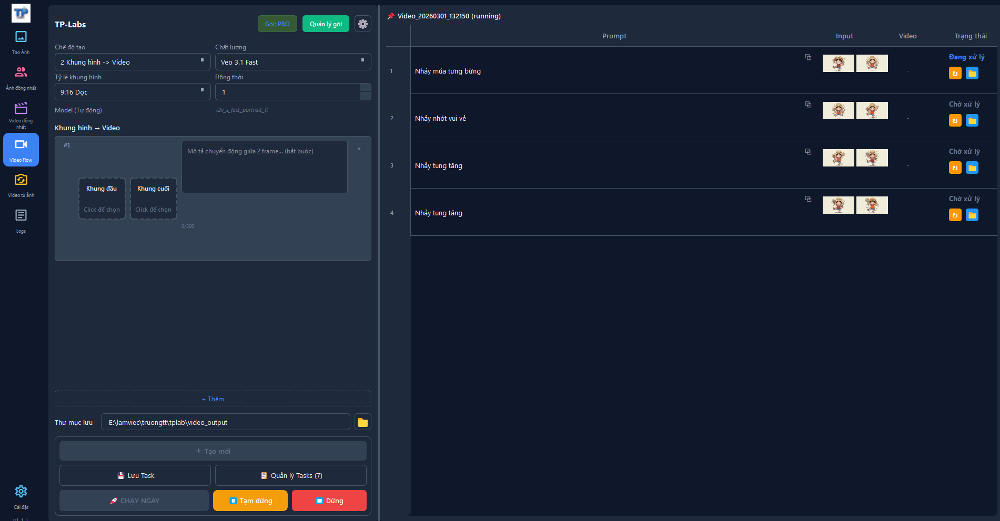
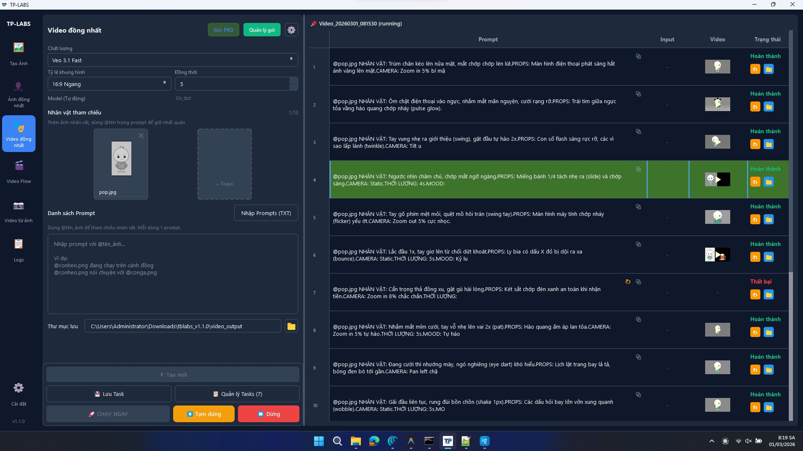

<p align="center">
  
</p>

<h1 align="center">TP-LABS Desktop App</h1>

<p align="center">
  <strong>Batch-generate hundreds of AI images & videos — fully automated on Windows</strong>
</p>

<p align="center">
  No more one-by-one clicking. TP-LABS turns your prompts into hundreds of AI images and videos in minutes.<br>
  Character-consistent generation, automated account management, runs entirely offline on your machine.
</p>

<p align="center">
  
  
  
  
  
</p>

---

## Screenshots

### Character-Consistent Image Generation

> Use `@name` syntax to keep characters unified across hundreds of images — upload once, reuse forever.



### Frame-to-Video Generation

> Select start frame + end frame, describe the motion — Veo 3.1 generates the video. Supports batch processing.



### Character-Consistent Video Generation

> Combine character images with video prompts — batch-generate videos while keeping style and characters consistent.



---

## Download & Get Started

1. Go to the [**Releases**](../../releases) page
2. Download the latest `.zip` archive
3. Extract to any folder
4. Run **`tplab.exe`** — done!

> **No Python installation required.** The release is fully standalone with all dependencies bundled.

### System Requirements

| Requirement | Details |
|-------------|---------|
| **OS** | Windows 10/11 (64-bit) |
| **RAM** | 4 GB minimum, 8 GB recommended |
| **Disk** | ~500 MB for the app + browser |
| **Network** | Internet connection required |

---

## Key Features

### Batch AI Image Generation

- **Whisk Service** — async image generation with automatic retry and validation
- **Flow Service** — image generation with reCAPTCHA token flow and reference image upload
- **Batch Processing** — run hundreds of prompts concurrently with smart throttling to avoid rate limits

### Character-Consistent Images

- `@name` syntax in prompts to reference characters
- Upload character images once — reused across all prompts in a task
- Autocomplete when typing `@` — fast and accurate

### AI Video Generation

- **3 Generation Modes:**
  - `Text → Video` — generate video from text descriptions
  - `Reference → Video` — use reference images to guide video style
  - `Frame → Video` — select start + end frames, describe the motion
- **Character-Consistent Video** — combine `@name` with video for unified characters
- **Batch Video from Image Folder** — scan folder, map images to prompts, generate videos in bulk
- **Full Lifecycle** — submit → poll → download → save, fully automated
- **Video Concatenation** — built-in FFmpeg for merging and post-processing

### Account & Session Management

- Playwright-based browser automation with stealth mode
- Multi-account support with persistent sessions
- Automatic session recovery, cookie management, and browser header sync
- Google Labs account tier/credit status checking

### Membership & Subscription

- Google Token / License Key authentication
- Purchase membership tiers — QR payment via SePay
- Real-time order status tracking
- **Tier-based feature gating** — features and concurrency limits enforced per subscription tier

---

## Architecture

```
tplab/
├── tplab.exe              # Main executable
├── playwright/            # Bundled Chromium browser + driver
│   └── driver/
│       └── package/
│           └── .local-browsers/
├── ffmpeg/                # Bundled FFmpeg for video processing
├── src/
│   └── ui/
│       └── styles/        # Theme files (Dark/Light)
└── [runtime dependencies]
```

### Tech Stack

| Component | Technology |
|-----------|-----------|
| **UI Framework** | PySide6 (Qt for Python) |
| **Browser Engine** | Playwright + Chromium (stealth) |
| **HTTP Client** | httpx (async) |
| **Database** | SQLite (local task persistence) |
| **Data Models** | Pydantic v2 |
| **Video Processing** | FFmpeg (concat + post-processing) |
| **AI Models** | Google Whisk, Flow, Veo 3.1 |
| **Compiler** | Nuitka (Python → native executable) |

---

## Performance

- **Bounded Concurrency** — semaphore throttling prevents API rate limiting
- **Non-blocking UI** — all long-running operations run on async worker threads
- **Smart Retries** — exponential backoff with clear bounds
- **Upload Once** — character images uploaded once per task, reused across all prompts
- **Model Cache** — video model config cached for 24h to reduce API calls
- **Session Persistence** — SQLite-backed task state survives app restarts

---

## Security

- Auth tokens stored securely via Windows DPAPI (`CustomerTokenStore`)
- No sensitive data logged (token redaction)
- Isolated customer auth domain (separate from browser sessions)
- Serialized refresh token rotation — no race conditions
- Device binding via SHA256 fingerprint

---

## Design

Supports **Dark/Light themes** — Tailwind Slate + Blue palette:

- Dark backgrounds (`#0f172a` / `#1e293b`) for reduced eye strain
- Blue accent colors (`#3b82f6`) for interactive elements
- WCAG AA+ compliant text contrast
- Smooth 200ms transitions and hover effects

---

## Changelog

See [CHANGELOG](docs/project-changelog.md) for version history and release notes.

---

## Support

If you encounter any issues or have questions:

- Contact the development team
- Open an issue in this repository

---

## License

This software is proprietary. All rights reserved.

---

<p align="center">
  <sub>Built with Python, PySide6, and Playwright</sub>
</p>
