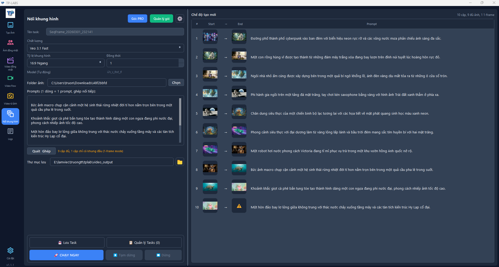
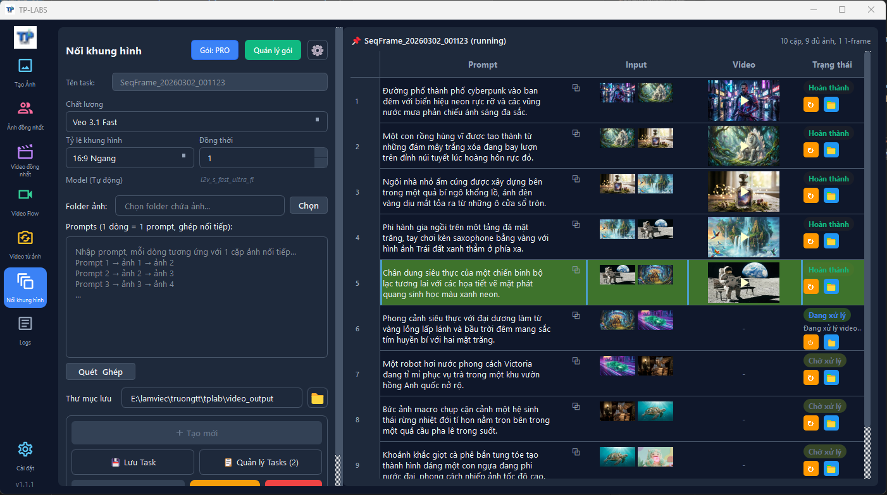

<p align="center">
  
</p>

<h1 align="center">TP-LABS Desktop App</h1>

<p align="center">
  <strong>Tạo hàng trăm ảnh & video AI cùng lúc — tự động hoàn toàn trên Windows</strong>
</p>

<p align="center">
  Không cần click từng cái một. TP-LABS biến prompt thành hàng trăm ảnh và video AI chỉ trong vài phút.<br>
  Nhân vật nhất quán, nối video tuần tự, quản lý tài khoản tự động, chạy trên máy bạn.
</p>

<p align="center">
  
  
  
  
  
  
</p>

---

## Ảnh chụp màn hình

### Tạo ảnh nhân vật nhất quán

> Dùng cú pháp `@tên` để giữ nhân vật đồng nhất qua hàng trăm ảnh — upload 1 lần, tái sử dụng mãi mãi.


### Tạo video nhân vật nhất quán

> Kết hợp ảnh nhân vật với prompt video — tạo hàng loạt video giữ đúng phong cách và nhân vật.


### Nối khung hình tuần tự

> Nhập nhiều prompt chuyển cảnh, mỗi prompt kèm ảnh tham chiếu — app tạo chuỗi video liền mạch.



> Theo dõi tiến độ từng prompt theo thời gian thực, xem trước video và ảnh input ngay trong bảng.



### Tạo video từ khung hình

> Chọn khung đầu + khung cuối, mô tả chuyển động — Veo 3.1 sẽ tạo video cho bạn. Hỗ trợ batch hàng loạt.


---

## Tải về & Bắt đầu ngay

1. Truy cập trang [**Releases**](../../releases)
2. Tải file `.zip` phiên bản mới nhất
3. Giải nén vào thư mục bất kỳ
4. Chạy **`tplab.exe`** — xong!

> **Không cần cài Python.** Bản release đã đóng gói sẵn toàn bộ — chạy trực tiếp.

### Yêu cầu hệ thống

| Yêu cầu | Chi tiết |
| -------- | -------- |
| **Hệ điều hành** | Windows 10/11 (64-bit) |
| **RAM** | Tối thiểu 4 GB, khuyến nghị 8 GB |
| **Ổ cứng** | ~616 MB cho app + trình duyệt |
| **Mạng** | Cần kết nối Internet |

---

## Tính năng chính

### Tạo ảnh AI hàng loạt

- **Whisk Service** — tạo ảnh bất đồng bộ với retry và validation tự động
- **Flow Service** — tạo ảnh với upload ảnh tham chiếu và xử lý nâng cao
- **Xử lý batch** — chạy hàng trăm prompt cùng lúc, giới hạn đồng thời thông minh tránh rate limit

### Ảnh nhân vật nhất quán

- Cú pháp `@tên` trong prompt để tham chiếu nhân vật
- Upload ảnh nhân vật 1 lần — tái sử dụng cho toàn bộ prompt trong task
- Autocomplete khi gõ `@` — nhanh và chính xác

### Tạo video AI

- **3 chế độ tạo video:**
  - `Văn bản → Video` — tạo video từ mô tả văn bản
  - `Ảnh tham chiếu → Video` — dùng ảnh để định hướng phong cách video
  - `Khung hình → Video` — chọn khung đầu + khung cuối, mô tả chuyển động
- **Video nhân vật nhất quán** — kết hợp `@tên` với video, giữ nhân vật đồng nhất
- **Video từ thư mục ảnh** — quét thư mục, ánh xạ ảnh sang prompt, tạo video hàng loạt
- **Quy trình tự động** — gửi yêu cầu → theo dõi → tải về → lưu file
- **Ghép video** — tích hợp FFmpeg để nối và xử lý hậu kỳ

### Nối khung hình tuần tự *(Mới)*

- Nhập nhiều prompt chuyển cảnh liên tiếp, mỗi cảnh kèm ảnh tham chiếu
- App tạo video tuần tự liền mạch — xem trước ảnh input và tiến độ realtime
- Kết quả: chuỗi video có nội dung liên kết từ đầu đến cuối

### Quản lý tài khoản & phiên

- Hỗ trợ nhiều tài khoản với phiên làm việc lưu trữ lâu dài
- Tự động khôi phục phiên, quản lý cookie
- Kiểm tra tier/credit tài khoản Google Labs

### Thành viên & Gói đăng ký

- Đăng nhập bằng Google Token hoặc License Key
- Mua gói thành viên — thanh toán QR qua SePay
- Theo dõi trạng thái đơn hàng theo thời gian thực
- **Phân quyền theo gói** — giới hạn tính năng và số luồng đồng thời theo tier

### Quản lý task nâng cao *(Mới)*

- Đặt tên riêng cho từng task, lọc theo loại trang (ảnh/video/character)
- Tìm kiếm nhanh, xem tiến độ bằng thanh progress
- Xóa task kèm dọn sạch thư mục output (có xác nhận)

---

## Kiến trúc

```text
tplab/
├── tplab.exe              # File chạy chính
├── playwright/            # Trình duyệt Chromium đi kèm
│   └── driver/
│       └── package/
│           └── .local-browsers/
├── ffmpeg/                # FFmpeg cho xử lý video
├── src/
│   └── ui/
│       └── styles/        # Giao diện (Dark/Light theme)
└── [thư viện runtime]
```

### Công nghệ

| Thành phần | Công nghệ |
| ---------- | --------- |
| **Giao diện** | PySide6 (Qt for Python) |
| **Trình duyệt** | Playwright + Chromium |
| **HTTP Client** | httpx (bất đồng bộ) |
| **Cơ sở dữ liệu** | SQLite (lưu trữ task cục bộ) |
| **Data Models** | Pydantic v2 |
| **Xử lý video** | FFmpeg (ghép nối + hậu kỳ) |
| **AI Models** | Google Whisk, Flow, Veo 3.1 |
| **Đóng gói** | Nuitka (Python → native .exe) |

---

## Hiệu năng

- **Giới hạn đồng thời** — semaphore throttle, tránh rate limit API
- **Giao diện mượt mà** — mọi tác vụ nặng chạy trên worker thread riêng
- **Retry thông minh** — exponential backoff với giới hạn rõ ràng
- **Upload 1 lần** — ảnh nhân vật upload 1 lần, tái sử dụng cho toàn bộ prompt
- **Cache model** — cấu hình video model cache 24h, giảm API call
- **Lưu trữ trạng thái** — task state trên SQLite, restart app không mất dữ liệu

---

## Bảo mật

- Token lưu trữ an toàn qua Windows DPAPI (`CustomerTokenStore`)
- Không ghi log dữ liệu nhạy cảm (token redaction)
- Tách biệt hoàn toàn domain xác thực khách hàng với phiên trình duyệt
- Refresh token serialized — tránh race condition khi rotate
- Xác thực gắn liền thiết bị — mỗi máy 1 phiên duy nhất

---

## Giao diện

Hỗ trợ **Dark/Light theme** — bảng màu Tailwind Slate + Blue:

- Nền tối (`#0f172a` / `#1e293b`) — giảm mỏi mắt
- Màu nhấn xanh dương (`#3b82f6`) — phần tử tương tác
- Đạt chuẩn WCAG AA+ về độ tương phản
- Hiệu ứng chuyển tiếp mượt mà 200ms

---

## Lịch sử thay đổi

Xem [CHANGELOG](CHANGELOG.md) để theo dõi lịch sử phiên bản.

---

## Hỗ trợ

Nếu gặp vấn đề hoặc có câu hỏi:

- Liên hệ đội phát triển
- Tạo issue trong repository này

---

## Giấy phép

Phần mềm độc quyền. Bảo lưu mọi quyền.

---

<p align="center">
  <sub>Được xây dựng bằng Python, PySide6 và Playwright</sub>
</p>
